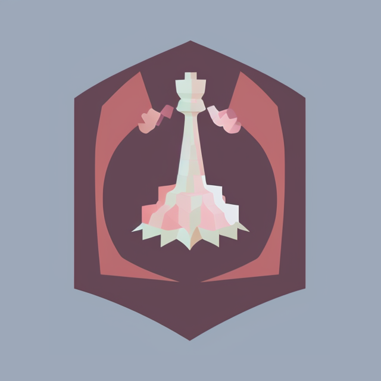

<p align="center">
 
</p>
<div align="center">

  <a href=""></a>
  <a href=""></a>
  <a href=""></a>
  <a href=""></a>
  <a href=""></a>
  
</div>

# chasse

Just a simple chessboard - without timers, rules etc. Play just like you do it OTB.

<https://chasse.fun>

## Build

Builds API binary and APP archive in `build/` folder

```bash

make build
```

## Run locally

Starts Redis using `docker-compose` and two processes: API and APP.

```bash
make run -j2

// cleanup after:
make clean
```
