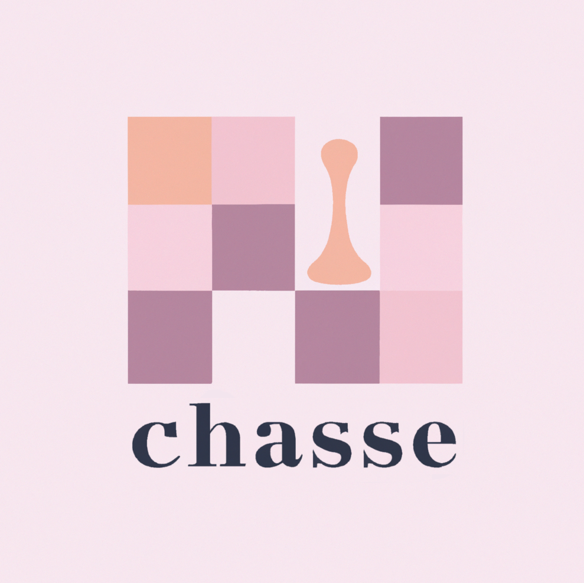

<p align="center">
 
</p>
<div align="center">

  <a href=""></a>
  <a href=""></a>
  <a href=""></a>
  <a href=""></a>
  <a href=""></a>
  
</div>

# Online chessboard

Just a simple chessboard - without timers, rules etc. Play just like you do it OTB.

<http://www.chessboard.tech/>

## Build an API

```bash
cd server/
GOOS=linux GOARCH=amd64 go build -o build/chess-amd64-linux main.go
```

## Build front-end

```bash
cd website/
npm i
npm run build
```
